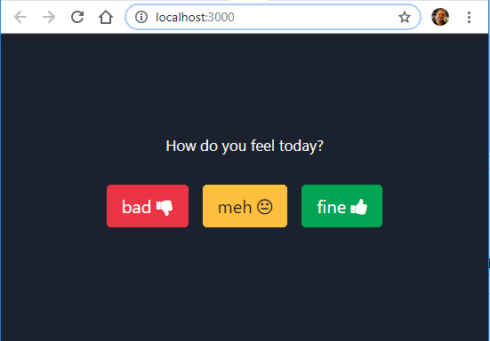

# moodometer

A simple app to capture team mood and see how it changes over time.

> This is a demo project showing how to create a serverless app in a few simple steps, inspired by https://serverless-stack.com

---

## Create React App

Ensure you have node 8.10+ and npm 6+ installed

```sh
$ node --version
v8.12.0

$ npm --version
6.4.1
```

Create your new app with [create-react-app](https://github.com/facebook/create-react-app)

```sh
npm init react-app moodometer
cd moodometer
npm start
```

---

## Add some UI libraries

Load Bootstrap CSS framework in the `head` tag of `public/index.html`

```html
<link
  rel="stylesheet"
  href="https://stackpath.bootstrapcdn.com/bootstrap/4.3.0/css/bootstrap.min.css"
/>
```

Install Chart.js charting package

```sh
npm i react-chartjs-2 chart.js
```

---

## Build the UI

Replace `src/App.js` with the following

```js
import React, { Component } from 'react'
import './App.css'
import { Doughnut } from 'react-chartjs-2'

const labels = ['so-so', 'good', 'great']
const buttons = ['btn-danger', 'btn-warning', 'btn-success']
const colors = ['#EB3547', '#FFC03E', '#00A553']

const Options = ({ onSelect }) => (
  <div>
    {buttons.map((btn, i) => (
      <button
        key={labels[i]}
        className={`btn ${btn} btn-lg m-2`}
        onClick={() => onSelect(i)}
      >
        {labels[i]}
      </button>
    ))}
  </div>
)

const Report = ({ answers }) => (
  <Doughnut
    height={120}
    options={{ maintainAspectRatio: false, legend: false, rotation: 1.57 }}
    data={{ labels, datasets: [{ data: answers, backgroundColor: colors }] }}
  />
)

class App extends Component {
  state = {
    answers: [0, 0, 0],
  }
  handleSelect = choice => {
    const answers = [...this.state.answers]
    answers[choice]++
    this.setState({ answers })
  }
  render() {
    return (
      <div className="App">
        <header className="App-header">
          <p>How do you feel today?</p>
          <Options onSelect={this.handleSelect} />
          <div className="fixed-bottom">
            <Report answers={this.state.answers} />
          </div>
        </header>
      </div>
    )
  }
}

export default App
```

## Check the new UI

Local build should be running at http://localhost:3000/



## Deploy the website to GitHub pages

Install `gh-pages` as a dev dependency

```sh
npm i -D gh-pages
```

Set homepage link in `package.json` and add deploy task

```js
{
  ...
  "homepage": "https://slavagu.github.io/moodometer",
  "scripts": {
    ...
    "predeploy": "npm run build",
    "deploy": "gh-pages -d build"
  },
}
```

Add `.env` file to the root of the project

```ini
PUBLIC_URL="https://slavagu.github.io/moodometer"
```

Deploy the website

```sh
npm run deploy
```

Production build should be running at https://slavagu.github.io/moodometer/

## Add serverless API

```

```
