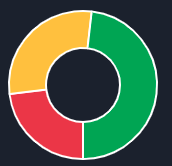
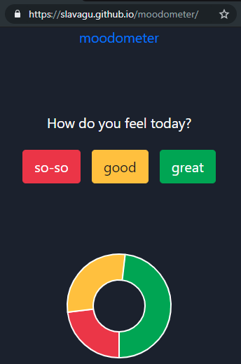

# moodometer - team mood tracker

A simple app to capture team mood and see how it changes over time.

> This is a demo project showing how to create a serverless app in a few simple steps, inspired by https://serverless-stack.com

---

## Build React UI

Ensure you have node 8.10+ and npm 6+ installed

```sh
$ node --version
v8.12.0

$ npm --version
6.4.1
```

Create your new app with [create-react-app](https://github.com/facebook/create-react-app)

```sh
npm init react-app moodometer
cd moodometer
npm start
```

Local build should be running at http://localhost:3000/

---

## Clean up

Edit [.gitignore](.gitignore) to exclude dependencies and temporary files from git

```ini
node_modules
coverage
build
.serverless
.DS_Store
npm-debug.log*
.env
```

Delete [package-lock.json](package-lock.json), which isn't necessary for this hobby project

Create `.npmrc` file to let npm know about this bold decision

```ini
package-lock=false
```

---

## Add libraries

Load Bootstrap CSS framework in the `head` tag of `public/index.html`

```html
<link
  rel="stylesheet"
  href="https://stackpath.bootstrapcdn.com/bootstrap/4.3.0/css/bootstrap.min.css"
/>
```

Install Chart.js charting package

```sh
npm i react-chartjs-2 chart.js
```

---

## Build the UI

Add a few voting buttons to capture user choice and a chart to show total team mood




---

## Add API

Create `api` folder with default `package.json`

```js
{
  "name": "moodometer-api",
  "version": "1.0.0",
  "description": "",
  "main": "handler.js",
  "author": "",
  "license": "ISC",
  "scripts": {
    "test": "echo \"Error: no test specified\" && exit 1"
  }
}
```

Create `.npmrc` file to avoid generation of `package-lock.json`

```
package-lock=false
```

---

## Install serverless framework

```sh
cd api
npm i -D serverless serverless-offline
```

Add into `package.json` scripts section

```js
{
  "start": "serverless offline start --port 4000",
  "deploy": "serverless deploy --verbose",
}
```

---

## Configure API endpoints

Define serverless functions in `serverless.yml`

```yaml
functions:
  getMood:
    handler: handler.getMood
    events:
      - http:
          path: mood
          method: get
          cors: true
  postMood:
    handler: handler.postMood
    events:
      - http:
          path: mood
          method: post
          cors: true
```

---

## Define API implementation

`handler.js` is the entry point for all lambda invocations

```js
const moodService = require('./moodService')

module.exports.getMood = async event => {
  const result = await moodService.getMood()
  return {
    statusCode: 200,
    body: JSON.stringify(result),
  }
}

module.exports.postMood = async event => {
  const data = JSON.parse(event.body)
  const result = await moodService.updateMood(data)
  return {
    statusCode: 200,
    body: JSON.stringify(result),
  }
}
```

---

## Add DynamoDB table definition

```yaml
resources:
  Resources:
    MoodDynamoDbTable:
      Type: 'AWS::DynamoDB::Table'
      Properties:
        TableName: ${self:custom.moodTableName}
        AttributeDefinitions:
          - AttributeName: date
            AttributeType: S
        KeySchema:
          - AttributeName: date
            KeyType: HASH
        ProvisionedThroughput:
          ReadCapacityUnits: 10
          WriteCapacityUnits: 10
```

---

## Use AWS SDK to access DynamoDB

Add sdk as a dev dependency because it's available in Lambda environment

```sh
npm i -D aws-sdk
```

`moodService.js` is managing all DB operations

```js
const AWS = require('aws-sdk')

const dynamoDb = new AWS.DynamoDB.DocumentClient()

module.exports.getMood = async () => {
  const result = await dynamoDb.get(params).promise()
}

module.exports.updateMood = async data => {
  const result = await dynamoDb.update(params).promise()
}
```

---

## Deploy the API

Use serverless offline to run API locally at http://localhost:4000/mood

```sh
cd api
npm start
```

Deploy the API to AWS using default profile

```sh
npm run deploy
```

Online API should be available at https://RANDOMID.execute-api.ap-southeast-2.amazonaws.com/dev/mood

---

## Consume mood API in the UI

Get/update is originated in [App.js](src/App.js)

```js
import { getMood, postMood } from './moodClient'

class App extends Component {
  async componentDidMount() {
    const teamMood = await getMood()
    this.setState({ teamMood })
  }

  handleSelect = async id => {
    const userMood = getUserMood(id)
    const teamMood = await postMood(userMood)
    this.setState({ teamMood })
  }
}

export default App
```

---

## Deploy the UI to GitHub pages

Install `gh-pages` as a dev dependency

```sh
npm i -D gh-pages
```

Set homepage link in `package.json` and add deploy task

```js
{
  "homepage": "https://slavagu.github.io/moodometer",
  "scripts": {
    "predeploy": "npm run build",
    "deploy": "gh-pages -d build"
  },
}
```

Deploy the website

```sh
npm run deploy
```

Online build should be running at https://slavagu.github.io/moodometer/

---



## The end
