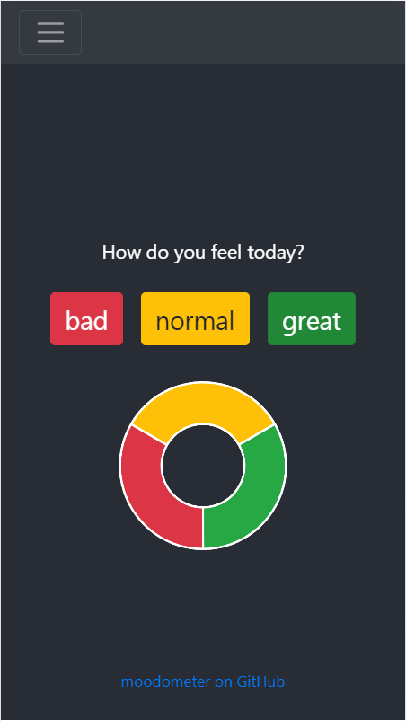
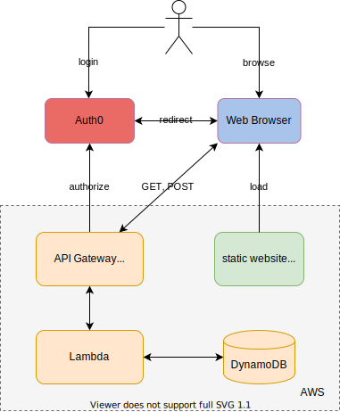

# moodometer - team mood tracker

A simple web app to capture team mood and see how it changes over time.

Website https://moodometer.mymo.com.au

## architecture

Inspired by serverless-stack.com and built with NodeJS, ReactJS, Lambda, DynamoDB, AWS API Gateway (HTTP API + JWT Authorizer), Auth0 and deployed to AWS using serverless.com framework

## development

To run both UI and API in a local dev environment: `npm run dev`

NOTE locally running API has no auth validation and will use default aws profile to access AWS resources in the cloud.
